# Task Graph — 001-speckit-tui-dashboard

## ✓ Graph is acyclic and consistent

## Status counts (effective)

| Status | Count |
|--------|-------|
| [X] done | 74 |
| [S] synthetic | 0 |
| [S*] auto-synthetic | 0 |

## Graph

```mermaid
graph TD
  T001["T001 Update `Directory.Build.props` to target `net10.0`"]:::done
  T002["T002 Scaffold `src/Core` F# library project and add it "]:::done
  T003["T003 Scaffold `src/Dashboard` F# console project and ad"]:::done
  T004["T004 Add Spectre.Console dependency to `src/Dashboard/D"]:::done
  T005["T005 Scaffold `tests/Core.Tests` and `tests/Dashboard.T"]:::done
  T006["T006 Create `specs/001-speckit-tui-dashboard/readiness/"]:::done
  T007["T007 Update `README.md` with build, run, and test comma"]:::done
  T008["T008 Record feature tier, affected public surfaces, and"]:::done
  T009["T009 Draft public `.fsi` signatures for domain models, "]:::done
  T010["T010 Draft public `.fsi` signatures for Speckit artifac"]:::done
  T011["T011 Draft public `.fsi` signatures for Git feature dis"]:::done
  T012["T012 Draft public `.fsi` signatures for task graph cons"]:::done
  T013["T013 Draft public `.fsi` signatures for hotkey command "]:::done
  T014["T014 Implement shared domain records and diagnostic sev"]:::done
  T015["T015 Implement safe process execution wrapper for Git C"]:::done
  T016["T016 Implement repository path and user config path res"]:::done
  T017["T017 Add baseline parser and state reducer test fixture"]:::done
  T018["T018 Add FSI/prelude session coverage for the drafted c"]:::done
  T019["T019 Record public surface baseline for `src/Core` sign"]:::done
  T020["T020 Document unsupported terminal and repository-state"]:::done
  T021["T021 Add Core.Tests coverage for no `specs/` directory,"]:::done
  T022["T022 Add Dashboard.Tests coverage for empty-state snaps"]:::done
  T023["T023 Add Core.Tests coverage for partial artifacts prod"]:::done
  T024["T024 Add Dashboard.Tests coverage for manual and automa"]:::done
  T025["T025 Implement Speckit artifact discovery for absent, p"]:::done
  T026["T026 Implement feature status summarization for spec, p"]:::done
  T027["T027 Implement dashboard startup state loading that ret"]:::done
  T028["T028 Implement file watcher plus polling fallback refre"]:::done
  T029["T029 Render empty, partial, and diagnostic states with "]:::done
  T030["T030 Capture a manual smoke transcript for an empty pro"]:::done
  T031["T031 Add Core.Tests coverage for numeric, timestamp, an"]:::done
  T032["T032 Add Core.Tests coverage for deterministic tie-brea"]:::done
  T033["T033 Add integration tests with a temporary Git reposit"]:::done
  T034["T034 Add integration test coverage for checkout failure"]:::done
  T035["T035 Implement Git feature branch listing and Speckit f"]:::done
  T036["T036 Implement latest-feature selection using parsed or"]:::done
  T037["T037 Implement startup auto-checkout of the latest feat"]:::done
  T038["T038 Wire selected feature artifact loading after succe"]:::done
  T039["T039 Capture readiness evidence for startup selection u"]:::done
  T040["T040 Add Core.Tests coverage for user story extraction "]:::done
  T041["T041 Add Dashboard.Tests coverage for feature navigatio"]:::done
  T042["T042 Add Dashboard.Tests coverage for story navigation "]:::done
  T043["T043 Implement user story parsing with priority, accept"]:::done
  T044["T044 Implement default keyboard command routing for fea"]:::done
  T045["T045 Render feature navigation and left-side story pane"]:::done
  T046["T046 Implement manual checkout of older feature branche"]:::done
  T047["T047 Capture keyboard-only manual walkthrough for featu"]:::done
  T048["T048 Add Core.Tests coverage for plan extraction and mi"]:::done
  T049["T049 Add Core.Tests coverage for task parsing with raw "]:::done
  T050["T050 Add Core.Tests coverage for selected-story depende"]:::done
  T051["T051 Add Core.Tests coverage for missing task reference"]:::done
  T052["T052 Add Dashboard.Tests coverage for task node selecti"]:::done
  T053["T053 Implement plan loading and separate plan-pane mode"]:::done
  T054["T054 Implement task artifact parsing with raw status, d"]:::done
  T055["T055 Implement DAG construction for selected-story task"]:::done
  T056["T056 Render task graph, raw task statuses, malformed-re"]:::done
  T057["T057 Render task detail pane containing title, descript"]:::done
  T058["T058 Capture readiness evidence for plan pane, task gra"]:::done
  T059["T059 Add Core.Tests coverage for default command bindin"]:::done
  T060["T060 Add Core.Tests coverage for global config loading,"]:::done
  T061["T061 Add Dashboard.Tests coverage for hotkey reload app"]:::done
  T062["T062 Implement global hotkey config path resolution and"]:::done
  T063["T063 Implement hotkey validation, conflict reporting, a"]:::done
  T064["T064 Wire validated custom bindings into dashboard comm"]:::done
  T065["T065 Capture readiness evidence for default bindings, c"]:::done
  T066["T066 Run full `dotnet test` and fix failures across cor"]:::done
  T067["T067 Run `dotnet run --project src/Dashboard -- .` smok"]:::done
  T068["T068 Verify operation in Emacs vterm or capture an equi"]:::done
  T069["T069 Verify compact terminal layout keeps all panes rea"]:::done
  T070["T070 Verify performance targets for empty project start"]:::done
  T071["T071 Refresh README and quickstart documentation with f"]:::done
  T072["T072 Refresh public surface baseline after implementati"]:::done
  T073["T073 Run `.specify/extensions/evidence/scripts/bash/run"]:::done
  T074["T074 Run `.specify/extensions/evidence/scripts/bash/run"]:::done
  T003 --> T004
  T002 --> T005
  T003 --> T005
  T006 --> T008
  T008 --> T009
  T008 --> T010
  T008 --> T011
  T008 --> T012
  T008 --> T013
  T009 --> T014
  T008 --> T014
  T011 --> T015
  T008 --> T015
  T009 --> T016
  T008 --> T016
  T014 --> T017
  T008 --> T017
  T009 --> T018
  T010 --> T018
  T011 --> T018
  T012 --> T018
  T013 --> T018
  T008 --> T018
  T009 --> T019
  T010 --> T019
  T011 --> T019
  T012 --> T019
  T013 --> T019
  T008 --> T019
  T014 --> T020
  T015 --> T020
  T016 --> T020
  T008 --> T020
  T020 --> T021
  T020 --> T022
  T020 --> T023
  T020 --> T024
  T021 --> T025
  T023 --> T025
  T020 --> T025
  T023 --> T026
  T025 --> T026
  T020 --> T026
  T022 --> T027
  T025 --> T027
  T026 --> T027
  T020 --> T027
  T024 --> T028
  T027 --> T028
  T020 --> T028
  T022 --> T029
  T026 --> T029
  T027 --> T029
  T020 --> T029
  T027 --> T030
  T028 --> T030
  T029 --> T030
  T020 --> T030
  T030 --> T031
  T030 --> T032
  T030 --> T033
  T030 --> T034
  T031 --> T035
  T030 --> T035
  T031 --> T036
  T032 --> T036
  T035 --> T036
  T030 --> T036
  T034 --> T037
  T036 --> T037
  T030 --> T037
  T033 --> T038
  T037 --> T038
  T030 --> T038
  T033 --> T039
  T037 --> T039
  T038 --> T039
  T030 --> T039
  T039 --> T040
  T039 --> T041
  T039 --> T042
  T040 --> T043
  T039 --> T043
  T041 --> T044
  T042 --> T044
  T039 --> T044
  T042 --> T045
  T043 --> T045
  T044 --> T045
  T039 --> T045
  T041 --> T046
  T044 --> T046
  T039 --> T046
  T045 --> T047
  T046 --> T047
  T039 --> T047
  T047 --> T048
  T047 --> T049
  T047 --> T050
  T047 --> T051
  T047 --> T052
  T048 --> T053
  T047 --> T053
  T049 --> T054
  T047 --> T054
  T050 --> T055
  T051 --> T055
  T054 --> T055
  T047 --> T055
  T052 --> T056
  T055 --> T056
  T047 --> T056
  T052 --> T057
  T054 --> T057
  T056 --> T057
  T047 --> T057
  T053 --> T058
  T056 --> T058
  T057 --> T058
  T047 --> T058
  T058 --> T059
  T058 --> T060
  T058 --> T061
  T060 --> T062
  T058 --> T062
  T059 --> T063
  T060 --> T063
  T062 --> T063
  T058 --> T063
  T061 --> T064
  T063 --> T064
  T058 --> T064
  T064 --> T065
  T058 --> T065
  T065 --> T066
  T066 --> T067
  T065 --> T067
  T067 --> T068
  T065 --> T068
  T067 --> T069
  T065 --> T069
  T067 --> T070
  T065 --> T070
  T067 --> T071
  T065 --> T071
  T066 --> T072
  T065 --> T072
  T065 --> T073
  T073 --> T074
  T065 --> T074
  classDef pending fill:#eeeeee,stroke:#999
  classDef done fill:#c8e6c9,stroke:#2e7d32
  classDef synthetic fill:#ffe0b2,stroke:#e65100,stroke-width:2px
  classDef autoSynthetic fill:#ffab91,stroke:#bf360c,stroke-width:2px,stroke-dasharray:5 3
  classDef failed fill:#ffcdd2,stroke:#b71c1c,stroke-width:2px
  classDef skipped fill:#f5f5f5,stroke:#666,stroke-dasharray:3 3
```



## ASCII view

```
T001 [X] Update `Directory.Build.props` to target `net10.0` and preserve F# warning policies
T002 [X] Scaffold `src/Core` F# library project and add it to the solution
T003 [X] Scaffold `src/Dashboard` F# console project and add it to the solution
T004 [X] Add Spectre.Console dependency to `src/Dashboard/Dashboard.fsproj`
T005 [X] Scaffold `tests/Core.Tests` and `tests/Dashboard.Tests` Expecto projects and remove or migrate existing `src/Lib` and `tests/Lib.Tests` placeholder projects from the solution
T006 [X] Create `specs/001-speckit-tui-dashboard/readiness/` for transcripts, screenshots, and graph evidence
T007 [X] Update `README.md` with build, run, and test commands for the dashboard app
T008 [X] Record feature tier, affected public surfaces, and evidence obligations in `readiness/evidence-plan.md`
T009 [X] Draft public `.fsi` signatures for domain models, diagnostics, and dashboard snapshots in `src/Core`
T010 [X] Draft public `.fsi` signatures for Speckit artifact discovery and parsing
T011 [X] Draft public `.fsi` signatures for Git feature discovery and checkout operations
T012 [X] Draft public `.fsi` signatures for task graph construction and validation
T013 [X] Draft public `.fsi` signatures for hotkey command maps and configuration validation
T014 [X] Implement shared domain records and diagnostic severity types in `src/Core/Domain.fs`
T015 [X] Implement safe process execution wrapper for Git CLI calls in `src/Core`
T016 [X] Implement repository path and user config path resolution helpers in `src/Core`
T017 [X] Add baseline parser and state reducer test fixtures for empty, partial, complete, and malformed Speckit projects
T018 [X] Add FSI/prelude session coverage for the drafted core public surface and save transcript to `readiness/fsi-session.txt`
T019 [X] Record public surface baseline for `src/Core` signatures in `readiness/public-surface.txt`
T020 [X] Document unsupported terminal and repository-state diagnostics in `readiness/unsupported-scope.md`
T021 [X] Add Core.Tests coverage for no `specs/` directory, empty `specs/`, and missing feature artifacts
T022 [X] Add Dashboard.Tests coverage for empty-state snapshot rendering without throwing
T023 [X] Add Core.Tests coverage for partial artifacts producing present/missing/unreadable states
T024 [X] Add Dashboard.Tests coverage for manual and automatic refresh events coalescing into a new snapshot
T025 [X] Implement Speckit artifact discovery for absent, partial, and complete feature directories
T026 [X] Implement feature status summarization for spec, plan, tasks, and checklist artifact states, including missing, present, unreadable, malformed, and locally complete states
T027 [X] Implement dashboard startup state loading that returns an empty actionable state instead of exiting
T028 [X] Implement file watcher plus polling fallback refresh orchestration
T029 [X] Render empty, partial, and diagnostic states with visible refresh, quit, branch-selection, and Speckit-artifact guidance actions when applicable
T030 [X] Capture a manual smoke transcript for an empty project and partial artifact project in `readiness/us1-empty-state.txt`
T031 [X] Add Core.Tests coverage for numeric, timestamp, and fallback feature branch ordering
T032 [X] Add Core.Tests coverage for deterministic tie-breaking when feature branches share an order key
T033 [X] Add integration tests with a temporary Git repository containing at least 10 feature branches
T034 [X] Add integration test coverage for checkout failure caused by local project state
T035 [X] Implement Git feature branch listing and Speckit feature-name parsing
T036 [X] Implement latest-feature selection using parsed ordering and deterministic tie-breaking
T037 [X] Implement startup auto-checkout of the latest feature branch with visible error diagnostics
T038 [X] Wire selected feature artifact loading after successful or failed checkout
T039 [X] Capture readiness evidence for startup selection under 10 branches and checkout failure handling
T040 [X] Add Core.Tests coverage for user story extraction from feature specifications
T041 [X] Add Dashboard.Tests coverage for feature navigation commands updating selected feature state
T042 [X] Add Dashboard.Tests coverage for story navigation commands updating selected story state
T043 [X] Implement user story parsing with priority, acceptance scenarios, and source locations
T044 [X] Implement default keyboard command routing for feature, story, pane, refresh, checkout, details, and quit commands
T045 [X] Render feature navigation and left-side story pane with selected item highlighting
T046 [X] Implement manual checkout of older feature branches and visible blocked-action diagnostics
T047 [X] Capture keyboard-only manual walkthrough for feature and story navigation in `readiness/us3-keyboard-navigation.txt`
T048 [X] Add Core.Tests coverage for plan extraction and missing-plan diagnostics
T049 [X] Add Core.Tests coverage for task parsing with raw status preservation
T050 [X] Add Core.Tests coverage for selected-story dependency chains including cross-story dependencies
T051 [X] Add Core.Tests coverage for missing task references, duplicate task IDs, and cycle diagnostics
T052 [X] Add Dashboard.Tests coverage for task node selection and detail pane state
T053 [X] Implement plan loading and separate plan-pane model
T054 [X] Implement task artifact parsing with raw status, dependencies, story relationship, and source location
T055 [X] Implement DAG construction for selected-story tasks plus dependency chains
T056 [X] Render task graph, raw task statuses, malformed-relationship diagnostics, and keyboard node selection
T057 [X] Render task detail pane containing title, description, raw status, dependencies, story relationship, and source location
T058 [X] Capture readiness evidence for plan pane, task graph, cross-story dependency, and malformed graph scenarios
T059 [X] Add Core.Tests coverage for default command bindings covering every primary command
T060 [X] Add Core.Tests coverage for global config loading, unsupported key sequences, and conflict diagnostics
T061 [X] Add Dashboard.Tests coverage for hotkey reload applying valid overrides
T062 [X] Implement global hotkey config path resolution and JSON loading
T063 [X] Implement hotkey validation, conflict reporting, and fallback to defaults
T064 [X] Wire validated custom bindings into dashboard command routing and reload command
T065 [X] Capture readiness evidence for default bindings, custom override, and conflict diagnostics
T066 [X] Run full `dotnet test` and fix failures across core, dashboard, and integration suites
T067 [X] Run `dotnet run --project src/Dashboard -- .` smoke test from the repository root and capture transcript
T068 [X] Verify operation in Emacs vterm or capture an equivalent terminal transcript documenting compatibility
T069 [X] Verify compact terminal layout keeps all panes reachable through focus changes or scrolling
T070 [X] Verify performance targets for empty project startup, 10-branch latest selection, and 2-second refresh behavior
T071 [X] Refresh README and quickstart documentation with final command names and configuration path details
T072 [X] Refresh public surface baseline after implementation changes
T073 [X] Run `.specify/extensions/evidence/scripts/bash/run-audit.sh --graph-only` and confirm no cycles or dangling refs
T074 [X] Run `.specify/extensions/evidence/scripts/bash/run-audit.sh` and record PASS or any accepted synthetic evidence rationale
```

