# Task Graph — 002-configurable-dashboard-ui

## ✓ Graph is acyclic and consistent

## Status counts (effective)

| Status | Count |
|--------|-------|
| [X] done | 57 |
| [S] synthetic | 0 |
| [S*] auto-synthetic | 0 |

## Graph

```mermaid
graph TD
  T001["T001 Create `specs/002-configurable-dashboard-ui/readin"]:::done
  T002["T002 Record Tier 1 public-surface impact and evidence o"]:::done
  T003["T003 Add preference contract examples from `contracts/d"]:::done
  T004["T004 Review existing hotkey config docs and identify RE"]:::done
  T005["T005 Draft updated public `.fsi` signatures for dashboa"]:::done
  T006["T006 Add Core.Tests coverage for parsing a combined das"]:::done
  T007["T007 Add Core.Tests coverage for default UI preferences"]:::done
  T008["T008 Add Core.Tests coverage for named color values and"]:::done
  T009["T009 Add Core.Tests coverage for invalid colors, unknow"]:::done
  T010["T010 Add Core.Tests coverage for low-contrast foregroun"]:::done
  T011["T011 Add Dashboard.Tests coverage for automatic layout "]:::done
  T012["T012 Exercise the drafted preference-loading public sur"]:::done
  T013["T013 Implement core preference domain types and default"]:::done
  T014["T014 Implement dashboard preference loading that preser"]:::done
  T015["T015 Implement color value parsing and validation for n"]:::done
  T016["T016 Implement low-contrast detection and fallback diag"]:::done
  T017["T017 Implement layout mode parsing and automatic layout"]:::done
  T018["T018 Refresh public surface baseline for changed Core s"]:::done
  T019["T019 Add Dashboard.Tests rendering coverage for configu"]:::done
  T020["T020 Add Dashboard.Tests coverage that built-in colors "]:::done
  T021["T021 Add dashboard smoke scenario using a real preferen"]:::done
  T022["T022 Route validated UI color preferences from startup "]:::done
  T023["T023 Replace hardcoded renderer color literals with con"]:::done
  T024["T024 Apply color role preferences consistently to featu"]:::done
  T025["T025 Surface invalid color and low-contrast fallback di"]:::done
  T026["T026 Document color roles, named color values, hex RGB "]:::done
  T027["T027 Capture manual color-configuration evidence in `re"]:::done
  T028["T028 Add Dashboard.Tests coverage for explicit `widescr"]:::done
  T029["T029 Add Dashboard.Tests coverage that `auto` uses vert"]:::done
  T030["T030 Add rendering smoke coverage that vertical layout "]:::done
  T031["T031 Implement layout selection plumbing from validated"]:::done
  T032["T032 Split the current renderer into reusable section r"]:::done
  T033["T033 Implement widescreen layout preserving side-by-sid"]:::done
  T034["T034 Implement vertical layout stacking primary section"]:::done
  T035["T035 Implement automatic layout selection based on the "]:::done
  T036["T036 Preserve selected feature, story, and task state a"]:::done
  T037["T037 Document layout modes and automatic threshold in R"]:::done
  T038["T038 Capture wide and narrow layout evidence in `readin"]:::done
  T039["T039 Add Core.Tests coverage for unreadable, empty, mal"]:::done
  T040["T040 Add Dashboard.Tests coverage that valid preference"]:::done
  T041["T041 Add dashboard smoke scenario for invalid layout an"]:::done
  T042["T042 Ensure preference loading accumulates actionable d"]:::done
  T043["T043 Ensure invalid UI preferences never prevent dashbo"]:::done
  T044["T044 Ensure valid hotkeys and valid UI preferences cont"]:::done
  T045["T045 Render preference diagnostics with source context "]:::done
  T046["T046 Document invalid preference recovery behavior and "]:::done
  T047["T047 Capture invalid-preference recovery evidence in `r"]:::done
  T048["T048 Run full `dotnet test` and fix failures across Cor"]:::done
  T049["T049 Run FSI/prelude evidence for the final public pref"]:::done
  T050["T050 Run dashboard smoke checks for default, configured"]:::done
  T051["T051 Update `README.md` and `specs/002-configurable-das"]:::done
  T052["T052 Bump package version in `Directory.Build.props`, p"]:::done
  T053["T053 Run `.specify/extensions/evidence/scripts/bash/run"]:::done
  T054["T054 Run `.specify/extensions/evidence/scripts/bash/run"]:::done
  T055["T055 Validate changed public surface baseline with an a"]:::done
  T056["T056 Add Dashboard.Tests coverage that feature, story, "]:::done
  T057["T057 Capture smoke evidence for keyboard navigation in "]:::done
  T004 --> T005
  T004 --> T006
  T004 --> T007
  T004 --> T008
  T004 --> T009
  T004 --> T010
  T004 --> T011
  T005 --> T012
  T004 --> T012
  T005 --> T013
  T006 --> T013
  T007 --> T013
  T004 --> T013
  T013 --> T014
  T006 --> T014
  T007 --> T014
  T009 --> T014
  T004 --> T014
  T013 --> T015
  T008 --> T015
  T009 --> T015
  T004 --> T015
  T013 --> T016
  T010 --> T016
  T004 --> T016
  T013 --> T017
  T011 --> T017
  T004 --> T017
  T005 --> T018
  T004 --> T018
  T055 --> T019
  T055 --> T020
  T055 --> T021
  T014 --> T022
  T019 --> T022
  T020 --> T022
  T055 --> T022
  T022 --> T023
  T019 --> T023
  T055 --> T023
  T023 --> T024
  T019 --> T024
  T055 --> T024
  T016 --> T025
  T024 --> T025
  T055 --> T025
  T024 --> T026
  T055 --> T026
  T021 --> T027
  T024 --> T027
  T025 --> T027
  T055 --> T027
  T027 --> T028
  T027 --> T029
  T027 --> T030
  T017 --> T031
  T028 --> T031
  T027 --> T031
  T031 --> T032
  T028 --> T032
  T027 --> T032
  T032 --> T033
  T028 --> T033
  T027 --> T033
  T032 --> T034
  T030 --> T034
  T027 --> T034
  T031 --> T035
  T029 --> T035
  T027 --> T035
  T031 --> T036
  T035 --> T036
  T027 --> T036
  T033 --> T037
  T034 --> T037
  T035 --> T037
  T027 --> T037
  T030 --> T038
  T033 --> T038
  T034 --> T038
  T035 --> T038
  T027 --> T038
  T038 --> T039
  T038 --> T040
  T038 --> T041
  T014 --> T042
  T039 --> T042
  T038 --> T042
  T042 --> T043
  T039 --> T043
  T038 --> T043
  T042 --> T044
  T040 --> T044
  T038 --> T044
  T042 --> T045
  T041 --> T045
  T038 --> T045
  T043 --> T046
  T044 --> T046
  T045 --> T046
  T038 --> T046
  T041 --> T047
  T043 --> T047
  T044 --> T047
  T045 --> T047
  T038 --> T047
  T047 --> T048
  T048 --> T049
  T047 --> T049
  T048 --> T050
  T047 --> T050
  T026 --> T051
  T037 --> T051
  T046 --> T051
  T047 --> T051
  T048 --> T052
  T050 --> T052
  T051 --> T052
  T047 --> T052
  T047 --> T053
  T053 --> T054
  T047 --> T054
  T018 --> T055
  T004 --> T055
  T027 --> T056
  T033 --> T057
  T034 --> T057
  T035 --> T057
  T036 --> T057
  T056 --> T057
  T027 --> T057
  classDef pending fill:#eeeeee,stroke:#999
  classDef done fill:#c8e6c9,stroke:#2e7d32
  classDef synthetic fill:#ffe0b2,stroke:#e65100,stroke-width:2px
  classDef autoSynthetic fill:#ffab91,stroke:#bf360c,stroke-width:2px,stroke-dasharray:5 3
  classDef failed fill:#ffcdd2,stroke:#b71c1c,stroke-width:2px
  classDef skipped fill:#f5f5f5,stroke:#666,stroke-dasharray:3 3
```



## ASCII view

```
T001 [X] Create `specs/002-configurable-dashboard-ui/readiness/` for FSI transcripts, layout smoke captures, and validation evidence
T002 [X] Record Tier 1 public-surface impact and evidence obligations in `specs/002-configurable-dashboard-ui/readiness/evidence-plan.md`
T003 [X] Add preference contract examples from `contracts/dashboard-ui-preferences.md` to readiness fixtures
T004 [X] Review existing hotkey config docs and identify README/quickstart sections that must mention UI preferences
T005 [X] Draft updated public `.fsi` signatures for dashboard preferences, UI preferences, color roles, layout modes, and validation diagnostics in `src/Core`
T006 [X] Add Core.Tests coverage for parsing a combined dashboard preferences file containing both `bindings` and `ui`
T007 [X] Add Core.Tests coverage for default UI preferences when `ui` is absent
T008 [X] Add Core.Tests coverage for named color values and hex RGB color values
T009 [X] Add Core.Tests coverage for invalid colors, unknown color roles, unsupported layout modes, and partial fallback diagnostics
T010 [X] Add Core.Tests coverage for low-contrast foreground/background pairs falling back to defaults
T011 [X] Add Dashboard.Tests coverage for automatic layout selection below 120 columns and at 120+ columns
T012 [X] Exercise the drafted preference-loading public surface from FSI and save transcript to `readiness/fsi-session.txt`
T013 [X] Implement core preference domain types and defaults for UI settings in `src/Core`
T014 [X] Implement dashboard preference loading that preserves existing hotkey behavior while adding optional UI settings
T015 [X] Implement color value parsing and validation for named terminal colors and hex RGB colors
T016 [X] Implement low-contrast detection and fallback diagnostics for foreground/background color pairs
T017 [X] Implement layout mode parsing and automatic layout decision rules
T018 [X] Refresh public surface baseline for changed Core signatures in `readiness/public-surface.txt`
T019 [X] Add Dashboard.Tests rendering coverage for configured colors appearing on selected rows, last activity, progress, diagnostics, muted text, and panel accents
T020 [X] Add Dashboard.Tests coverage that built-in colors are used when no custom colors are configured
T021 [X] Add dashboard smoke scenario using a real preference file with named colors and hex RGB colors
T022 [X] Route validated UI color preferences from startup and reload paths into dashboard render state
T023 [X] Replace hardcoded renderer color literals with configurable color role lookups in `src/Dashboard/Render.fs`
T024 [X] Apply color role preferences consistently to feature rows, story rows, task rows, progress bars, diagnostics, muted text, and panel accents
T025 [X] Surface invalid color and low-contrast fallback diagnostics in the dashboard diagnostics pane
T026 [X] Document color roles, named color values, hex RGB values, and fallback behavior in README and quickstart
T027 [X] Capture manual color-configuration evidence in `readiness/us1-configurable-colors.txt`
T028 [X] Add Dashboard.Tests coverage for explicit `widescreen`, explicit `vertical`, and `auto` layout modes
T029 [X] Add Dashboard.Tests coverage that `auto` uses vertical below 120 columns and widescreen at 120+ columns
T030 [X] Add rendering smoke coverage that vertical layout keeps primary section headers readable in a narrow terminal
T031 [X] Implement layout selection plumbing from validated UI preferences into dashboard rendering
T032 [X] Split the current renderer into reusable section renderables that can be composed as widescreen or vertical layouts
T033 [X] Implement widescreen layout preserving side-by-side navigation and detail context
T034 [X] Implement vertical layout stacking primary sections in readable order
T035 [X] Implement automatic layout selection based on the 120-column threshold
T036 [X] Preserve selected feature, story, and task state across layout changes and preference reloads
T037 [X] Document layout modes and automatic threshold in README and quickstart
T038 [X] Capture wide and narrow layout evidence in `readiness/us2-layout-options.txt`
T039 [X] Add Core.Tests coverage for unreadable, empty, malformed, and partially valid dashboard preference files
T040 [X] Add Dashboard.Tests coverage that valid preferences still apply when sibling UI preferences are invalid
T041 [X] Add dashboard smoke scenario for invalid layout and invalid color values producing visible diagnostics
T042 [X] Ensure preference loading accumulates actionable diagnostics for every invalid UI setting
T043 [X] Ensure invalid UI preferences never prevent dashboard startup or live reload
T044 [X] Ensure valid hotkeys and valid UI preferences continue to apply when other preference values are invalid
T045 [X] Render preference diagnostics with source context where available
T046 [X] Document invalid preference recovery behavior and examples in README and quickstart
T047 [X] Capture invalid-preference recovery evidence in `readiness/us3-invalid-preferences.txt`
T048 [X] Run full `dotnet test` and fix failures across Core.Tests and Dashboard.Tests
T049 [X] Run FSI/prelude evidence for the final public preference-loading surface and refresh `readiness/fsi-session.txt`
T050 [X] Run dashboard smoke checks for default, configured-color, widescreen, vertical, auto, and invalid-preference scenarios
T051 [X] Update `README.md` and `specs/002-configurable-dashboard-ui/quickstart.md` with final preference examples and commands
T052 [X] Bump package version in `Directory.Build.props`, pack to `~/.local/share/nuget-local`, and update the global `sk-dashboard` tool
T053 [X] Run `.specify/extensions/evidence/scripts/bash/run-audit.sh --graph-only` and record PASS in `readiness/final-graph-audit.txt`
T054 [X] Run `.specify/extensions/evidence/scripts/bash/run-audit.sh` and record PASS or accepted-synthetic rationale in `readiness/final-evidence-audit.txt`
T055 [X] Validate changed public surface baseline with an automated test covering the updated Core `.fsi` signatures
T056 [X] Add Dashboard.Tests coverage that feature, story, and task keyboard navigation works in widescreen, vertical, and auto layout modes
T057 [X] Capture smoke evidence for keyboard navigation in widescreen, vertical, and auto layout modes
```

