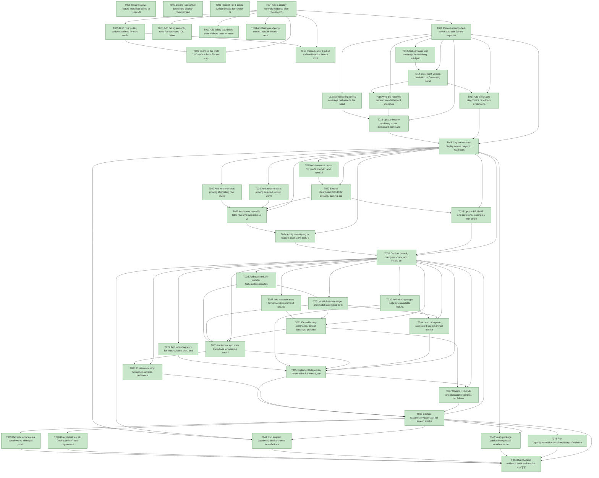

# Task Graph — 003-dashboard-display-controls

## ✓ Graph is acyclic and consistent

## Status counts (effective)

| Status | Count |
|--------|-------|
| [X] done | 44 |
| [S] synthetic | 0 |
| [S*] auto-synthetic | 0 |

## Graph



## ASCII view

```
T001 [X] Confirm active feature metadata points to `specs/003-dashboard-display-controls`
T002 [X] Create `specs/003-dashboard-display-controls/readiness/` for evidence transcripts, smoke output, and graph artifacts
T003 [X] Record Tier 1 public-surface impact for version display, stripe color roles, full-screen commands, and modal state in `readiness/public-surface.md`
T004 [X] Add a display-controls evidence plan covering FSI, semantic tests, render smoke checks, and package version verification
T005 [X] Draft `.fsi` public surface updates for new version metadata, row stripe roles, full-screen target/model types, and dashboard command cases
T006 [X] Add failing semantic tests for command IDs, default full-screen bindings, stripe role parsing/defaults, and version fallback behavior
T007 [X] Add failing dashboard state reducer tests for opening, replacing, and closing full-screen modal targets without changing selected feature/story/task
T008 [X] Add failing rendering smoke tests for header version placement, stripe precedence helpers, and full-screen single-target rendering
T009 [X] Exercise the draft `.fsi` surface from FSI and capture transcript to `readiness/fsi-session.txt`
T010 [X] Record current public surface baseline before implementation in `readiness/public-surface-baseline.txt`
T011 [X] Record unsupported-scope and safe-failure expectations for missing version metadata, missing source text, invalid stripe colors, and unavailable full-screen targets
T012 [X] Add semantic test coverage for resolving build/package version metadata and `vunknown` fallback through the public surface
T013 [X] Add rendering smoke coverage that asserts the header contains `sk-dashboard` plus a version value in wide and narrow layouts
T014 [X] Implement version resolution in Core using installed assembly/package metadata with a stable fallback value
T015 [X] Wire the resolved version into dashboard snapshot/rendering inputs without reading source checkout files at runtime
T016 [X] Update header rendering so the dashboard name and version remain visible in widescreen and vertical layouts
T017 [X] Add actionable diagnostics or fallback evidence for unavailable version metadata
T018 [X] Capture version-display smoke output in `readiness/us1-version-header.txt`
T019 [X] Add semantic tests for `rowStripeOdd` and `rowStripeEven` preference parsing, defaults, invalid values, and low-contrast fallback
T020 [X] Add renderer tests proving alternating row styles apply to feature, story, task, diagnostic, and detail-style tables
T021 [X] Add renderer tests proving selected, active, warning, and error row states override stripe backgrounds
T022 [X] Extend `DashboardColorRole` defaults, parsing, diagnostics, and preference contract support for row stripe roles
T023 [X] Implement reusable table row style selection so visible non-header data rows alternate safely
T024 [X] Apply row striping to feature, user story, task, diagnostic, and detail-like tables without changing selection or ordering behavior
T025 [X] Update README and preference examples with stripe color roles and safe-fallback behavior
T026 [X] Capture default, configured-color, and invalid-stripe smoke outputs in readiness artifacts
T027 [X] Add semantic tests for full-screen command IDs, default bindings, and user-configured binding overrides
T028 [X] Add state reducer tests for feature/story/plan/task modal open, modal replacement, close behavior, and selection preservation
T029 [X] Add rendering tests for feature, story, plan, and task full-screen views showing parsed fields plus source text when available
T030 [X] Add missing-target tests for unavailable feature, story, plan, task, source text, and diagnostics
T031 [X] Add full-screen target and modal state types to the public domain surface
T032 [X] Extend hotkey commands, default bindings, preference parsing, scripted key handling, and footer/help text for four full-screen commands
T033 [X] Implement app state transitions for opening each full-screen target, using selected story/task first and active fallback only when no selected item exists, replacing an open target, and closing without changing selections
T034 [X] Load or expose associated source artifact text for selected feature, story, plan, and task targets with safe unreadable/missing handling
T035 [X] Implement full-screen renderables for feature, story, plan, and task views with exactly one requested target type per modal
T036 [X] Preserve existing navigation, refresh, preference reload, and quit behavior outside full-screen views
T037 [X] Update README and quickstart examples for full-screen hotkeys and scripted smoke checks
T038 [X] Capture feature/story/plan/task full-screen smoke transcripts in readiness artifacts
T039 [X] Refresh surface-area baselines for changed public modules after implementation
T040 [X] Run `dotnet test sk-Dashboard.sln` and capture output to `readiness/dotnet-test.txt`
T041 [X] Run scripted dashboard smoke checks for default navigation plus version, stripe, full-screen flows, table-like full-screen stripe behavior, and lightweight render-cycle/performance evidence
T042 [X] Verify package version bump/install workflow or document why package installation was not performed for this change
T043 [X] Run `.specify/extensions/evidence/scripts/bash/run-audit.sh --graph-only` and capture clean graph output
T044 [X] Run the final evidence audit and resolve any `[S]`, `[S*]`, or diff-scan hits before merge readiness
```

