# Task Graph — 004-table-settings-controls

## ✓ Graph is acyclic and consistent

## Status counts (effective)

| Status | Count |
|--------|-------|
| [X] done | 48 |
| [S] synthetic | 0 |
| [S*] auto-synthetic | 0 |

## Graph

```mermaid
graph TD
  T001["T001 Confirm the feature branch, spec, plan, contracts,"]:::done
  T002["T002 Create readiness scaffolding under `specs/004-tabl"]:::done
  T003["T003 Record the Tier 1 contract surfaces, affected modu"]:::done
  T004["T004 Map existing dashboard tables, detail surfaces, ho"]:::done
  T005["T005 Draft public Core `.fsi` signatures for table view"]:::done
  T006["T006 Add semantic test scaffolding in `tests/Core.Tests"]:::done
  T007["T007 Add dashboard reducer and rendering smoke test sca"]:::done
  T008["T008 Exercise the draft public signatures from FSI and "]:::done
  T009["T009 Record public surface baselines for changed `.fsi`"]:::done
  T010["T010 Define config diagnostics and safe fallback messag"]:::done
  T011["T011 Define shared JSON config fixtures covering defaul"]:::done
  T012["T012 Run the foundation test scaffolds once and capture"]:::done
  T013["T013 Add Core semantic tests for table viewport clampin"]:::done
  T014["T014 Add Dashboard smoke fixtures with oversized featur"]:::done
  T015["T015 Add Dashboard smoke tests for full detail pages wi"]:::done
  T016["T016 Implement typed table and detail viewport reducers"]:::done
  T017["T017 Wire vertical selection-anchored scrolling into al"]:::done
  T018["T018 Wire explicit horizontal table and detail scroll c"]:::done
  T019["T019 Update `src/Dashboard/Render.fs` to render viewpor"]:::done
  T020["T020 Update full detail rendering and state transitions"]:::done
  T021["T021 Capture US1 independent evidence in readiness arti"]:::done
  T022["T022 Add Core semantic tests for table border preferenc"]:::done
  T023["T023 Add Core semantic tests for detail formatting and "]:::done
  T024["T024 Add Dashboard rendering smoke tests proving every "]:::done
  T025["T025 Add Dashboard rendering smoke tests for readable d"]:::done
  T026["T026 Extend the shared dashboard settings model and JSO"]:::done
  T027["T027 Map supported border preferences to Spectre.Consol"]:::done
  T028["T028 Apply configurable detail formatting and color rol"]:::done
  T029["T029 Surface configuration diagnostics in the dashboard"]:::done
  T030["T030 Capture US2 independent evidence with config fixtu"]:::done
  T031["T031 Add Core semantic tests for settings edit sessions"]:::done
  T032["T032 Add Core semantic tests for live reload state tran"]:::done
  T033["T033 Add Dashboard smoke tests for opening the in-dashb"]:::done
  T034["T034 Add CLI smoke tests for `sk-dashboard --settings -"]:::done
  T035["T035 Register default hotkey bindings and command dispa"]:::done
  T036["T036 Implement the in-dashboard settings surface with e"]:::done
  T037["T037 Implement shared settings save/reload/discard/over"]:::done
  T038["T038 Add `sk-dashboard --settings` routing in `src/Dash"]:::done
  T039["T039 Implement debounced config file observation in the"]:::done
  T040["T040 Defer external reloads while a settings surface ha"]:::done
  T041["T041 Capture US3 independent evidence for hotkey settin"]:::done
  T042["T042 Refresh public surface baselines for all changed `"]:::done
  T043["T043 Run `dotnet fantomas` or the repository's formatte"]:::done
  T044["T044 Run `dotnet test sk-Dashboard.sln` and capture the"]:::done
  T045["T045 Run quickstart smoke checks for dashboard launch, "]:::done
  T046["T046 Update `specs/004-table-settings-controls/quicksta"]:::done
  T047["T047 Run `.specify/extensions/evidence/scripts/bash/run"]:::done
  T048["T048 Run `.specify/extensions/evidence/scripts/bash/run"]:::done
  T001 --> T004
  T004 --> T005
  T004 --> T006
  T004 --> T007
  T005 --> T008
  T004 --> T008
  T005 --> T009
  T004 --> T009
  T005 --> T010
  T004 --> T010
  T005 --> T011
  T004 --> T011
  T006 --> T012
  T007 --> T012
  T008 --> T012
  T009 --> T012
  T010 --> T012
  T011 --> T012
  T004 --> T012
  T012 --> T013
  T012 --> T014
  T012 --> T015
  T013 --> T016
  T012 --> T016
  T016 --> T017
  T012 --> T017
  T016 --> T018
  T012 --> T018
  T014 --> T019
  T017 --> T019
  T018 --> T019
  T012 --> T019
  T015 --> T020
  T018 --> T020
  T012 --> T020
  T019 --> T021
  T020 --> T021
  T012 --> T021
  T021 --> T022
  T021 --> T023
  T021 --> T024
  T021 --> T025
  T022 --> T026
  T023 --> T026
  T021 --> T026
  T024 --> T027
  T026 --> T027
  T021 --> T027
  T025 --> T028
  T026 --> T028
  T021 --> T028
  T026 --> T029
  T027 --> T029
  T028 --> T029
  T021 --> T029
  T027 --> T030
  T028 --> T030
  T029 --> T030
  T021 --> T030
  T030 --> T031
  T030 --> T032
  T030 --> T033
  T030 --> T034
  T031 --> T035
  T030 --> T035
  T033 --> T036
  T035 --> T036
  T030 --> T036
  T031 --> T037
  T036 --> T037
  T030 --> T037
  T034 --> T038
  T037 --> T038
  T030 --> T038
  T032 --> T039
  T037 --> T039
  T030 --> T039
  T032 --> T040
  T037 --> T040
  T039 --> T040
  T030 --> T040
  T036 --> T041
  T038 --> T041
  T039 --> T041
  T040 --> T041
  T030 --> T041
  T041 --> T042
  T041 --> T043
  T043 --> T044
  T041 --> T044
  T044 --> T045
  T041 --> T045
  T045 --> T046
  T041 --> T046
  T041 --> T047
  T044 --> T048
  T045 --> T048
  T047 --> T048
  T041 --> T048
  classDef pending fill:#eeeeee,stroke:#999
  classDef done fill:#c8e6c9,stroke:#2e7d32
  classDef synthetic fill:#ffe0b2,stroke:#e65100,stroke-width:2px
  classDef autoSynthetic fill:#ffab91,stroke:#bf360c,stroke-width:2px,stroke-dasharray:5 3
  classDef failed fill:#ffcdd2,stroke:#b71c1c,stroke-width:2px
  classDef skipped fill:#f5f5f5,stroke:#666,stroke-dasharray:3 3
```



## ASCII view

```
T001 [X] Confirm the feature branch, spec, plan, contracts, data model, and quickstart are present for `004-table-settings-controls`
T002 [X] Create readiness scaffolding under `specs/004-table-settings-controls/readiness/` for FSI transcripts, smoke logs, config fixtures, and rendered-output captures
T003 [X] Record the Tier 1 contract surfaces, affected modules, and required real-evidence paths in `specs/004-table-settings-controls/readiness/evidence-plan.md`
T004 [X] Map existing dashboard tables, detail surfaces, hotkeys, and config-loading entry points to the feature requirements
T005 [X] Draft public Core `.fsi` signatures for table viewport state, detail viewport state, display settings, color roles, config file state, settings edit sessions, and new command identifiers
T006 [X] Add semantic test scaffolding in `tests/Core.Tests` for settings parsing, validation defaults, hotkey command registration, viewport reducers, and conflict metadata
T007 [X] Add dashboard reducer and rendering smoke test scaffolding in `tests/Dashboard.Tests` for scrollable tables, detail scrolling, settings surfaces, and live reload
T008 [X] Exercise the draft public signatures from FSI and capture the transcript in `specs/004-table-settings-controls/readiness/fsi-session.txt`
T009 [X] Record public surface baselines for changed `.fsi` modules in `specs/004-table-settings-controls/readiness/surface-baseline.txt`
T010 [X] Define config diagnostics and safe fallback messages for invalid borders, colors, hotkeys, unreadable files, stale saves, and deferred reloads
T011 [X] Define shared JSON config fixtures covering defaults, unknown future fields, invalid known fields, border styles, detail color roles, and live reload settings
T012 [X] Run the foundation test scaffolds once and capture the expected failing or pending evidence in `specs/004-table-settings-controls/readiness/foundation-test-baseline.txt`
T013 [X] Add Core semantic tests for table viewport clamping, selection-anchored vertical scrolling, horizontal offsets, sticky columns, empty rows, deleted selections, and terminal resize
T014 [X] Add Dashboard smoke fixtures with oversized feature, story, task, diagnostic, and detail-oriented table data including 500-row and wide-cell cases
T015 [X] Add Dashboard smoke tests for full detail pages with at least 2,000 lines, vertical scrolling, horizontal scrolling, and close/reopen context restoration
T016 [X] Implement typed table and detail viewport reducers in `src/Core/Domain.fs` with `.fsi` exposure and safe clamp behavior
T017 [X] Wire vertical selection-anchored scrolling into all dashboard table navigation paths in `src/Dashboard/App.fs` and `src/Dashboard/Input.fs`
T018 [X] Wire explicit horizontal table and detail scroll commands through `src/Core/Hotkeys.fs`, `src/Dashboard/Input.fs`, and dashboard state
T019 [X] Update `src/Dashboard/Render.fs` to render viewport slices, sticky identifying columns, horizontal offsets, empty placeholders, and scroll indicators for all table surfaces
T020 [X] Update full detail rendering and state transitions so long detail content scrolls without losing the selected feature, story, plan, task, or diagnostic context
T021 [X] Capture US1 independent evidence in readiness artifacts by running semantic tests plus dashboard smoke navigation for large and wide tables
T022 [X] Add Core semantic tests for table border preference parsing, validation, defaults, unknown fields, and diagnostic reporting
T023 [X] Add Core semantic tests for detail formatting and color role parsing, safe defaults, invalid colors, and low-readability pair fallback
T024 [X] Add Dashboard rendering smoke tests proving every table surface applies `none`, `minimal`, `rounded`, and `heavy` borders consistently
T025 [X] Add Dashboard rendering smoke tests for readable detail headings, labels, status values, metadata, body text, warnings, errors, and source text
T026 [X] Extend the shared dashboard settings model and JSON parser in Core for `ui.table`, `ui.detail`, `ui.colors`, and per-field diagnostics
T027 [X] Map supported border preferences to Spectre.Console table border variants and apply the chosen style to feature, story, task, diagnostic, settings, and detail-oriented tables
T028 [X] Apply configurable detail formatting and color roles to all full detail render paths while preserving safe fallbacks for invalid settings
T029 [X] Surface configuration diagnostics in the dashboard without crashing or clearing the last valid display settings
T030 [X] Capture US2 independent evidence with config fixtures, semantic tests, rendered smoke output for each supported border and detail role fallback, and maintainer readability review results in `specs/004-table-settings-controls/readiness/detail-readability-review.md`
T031 [X] Add Core semantic tests for settings edit sessions, dirty state, loaded file versions, stale-save detection, reload, discard, and explicit overwrite
T032 [X] Add Core semantic tests for live reload state transitions, debounce values, last-valid settings retention, invalid config diagnostics, and deferred reloads for dirty sessions
T033 [X] Add Dashboard smoke tests for opening the in-dashboard settings page by hotkey within 2 seconds, preserving current selection, saving, discarding, and showing validation feedback
T034 [X] Add CLI smoke tests for `sk-dashboard --settings --config <path>` reading, validating, saving, and detecting stale config changes
T035 [X] Register default hotkey bindings and command dispatch for `settings.open`, settings save/discard/reload/overwrite, table horizontal scroll, and detail scroll commands
T036 [X] Implement the in-dashboard settings surface with editable sections for table behavior, borders, detail formatting, colors, hotkeys, and live reload
T037 [X] Implement shared settings save/reload/discard/overwrite workflows with validation messages and stale-save conflict handling
T038 [X] Add `sk-dashboard --settings` routing in `src/Dashboard/Program.fs` that uses the same config path and shared settings workflow as the running dashboard
T039 [X] Implement debounced config file observation in the running dashboard with last-valid settings retention and clear diagnostics for invalid or unreadable changes
T040 [X] Defer external reloads while a settings surface has unsaved edits and show pending conflict state until save, discard, reload, or overwrite
T041 [X] Capture US3 independent evidence for hotkey settings, standalone settings mode, conflict handling, settings page open time under 2 seconds, locating and editing key settings under 60 seconds, and live reload applying valid changes within 2 seconds
T042 [X] Refresh public surface baselines for all changed `.fsi` files and confirm Tier 1 contract additions are intentional
T043 [X] Run `dotnet fantomas` or the repository's formatter on changed F# source and test files where available
T044 [X] Run `dotnet test sk-Dashboard.sln` and capture the full test transcript in readiness artifacts
T045 [X] Run quickstart smoke checks for dashboard launch, large-table navigation, detail scrolling, standalone settings mode, invalid config, and live reload
T046 [X] Update `specs/004-table-settings-controls/quickstart.md` with any final command or interaction changes discovered during implementation
T047 [X] Run `.specify/extensions/evidence/scripts/bash/run-audit.sh --graph-only` and confirm no cycles, dangling refs, missing task ids, or unexpected propagation
T048 [X] Run `.specify/extensions/evidence/scripts/bash/run-audit.sh` and document a PASS verdict or every accepted synthetic-evidence override
```

