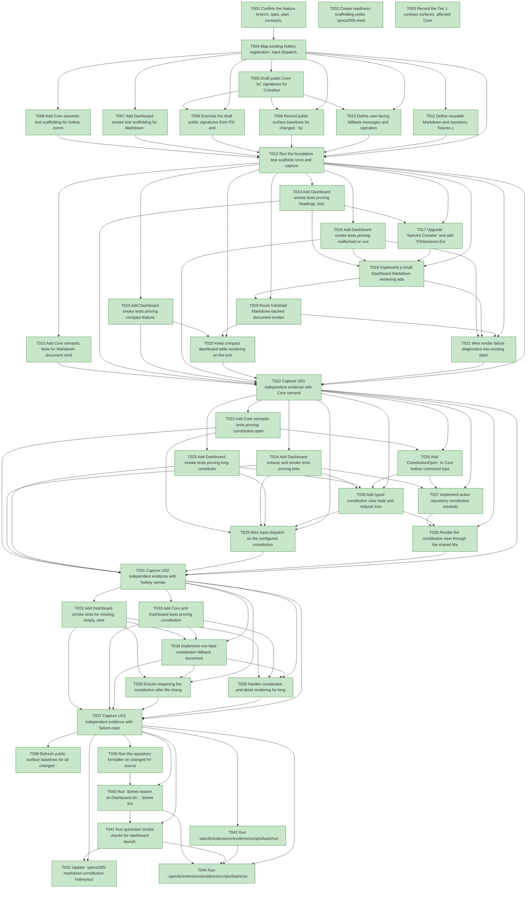

# Task Graph — 005-markdown-constitution-hotkey

## ✓ Graph is acyclic and consistent

## Status counts (effective)

| Status | Count |
|--------|-------|
| [X] done | 44 |
| [S] synthetic | 0 |
| [S*] auto-synthetic | 0 |

## Graph



## ASCII view

```
T001 [X] Confirm the feature branch, spec, plan, contracts, data model, quickstart, and requested NTokenizers package decision are present for `005-markdown-constitution-hotkey`
T002 [X] Create readiness scaffolding under `specs/005-markdown-constitution-hotkey/readiness/` for FSI transcripts, surface baselines, Markdown smoke captures, dashboard smoke logs, and failure-case transcripts
T003 [X] Record the Tier 1 contract surfaces, affected Core/Dashboard modules, dependency upgrade, and required real-evidence paths in `specs/005-markdown-constitution-hotkey/readiness/evidence-plan.md`
T004 [X] Map existing hotkey registration, input dispatch, detail/fullscreen rendering, table rendering, active repository resolution, and dashboard context restoration paths to the feature requirements
T005 [X] Draft public Core `.fsi` signatures for `ConstitutionOpen`, Markdown document state, constitution view state, source locations, render statuses, viewport state reuse, and render failure diagnostics
T006 [X] Add Core semantic test scaffolding for hotkey command ids, default bindings, public document/constitution state, viewport clamping, source paths, and diagnostic status values
T007 [X] Add Dashboard smoke test scaffolding for Markdown-rendered document views, compact plain table cells, constitution open/close/scroll flows, and constitution failure states
T008 [X] Exercise the draft public signatures from FSI and capture the transcript in `specs/005-markdown-constitution-hotkey/readiness/fsi-session.txt`
T009 [X] Record public surface baselines for changed `.fsi` modules in `specs/005-markdown-constitution-hotkey/readiness/surface-baseline.txt`
T010 [X] Define user-facing fallback messages and operational diagnostics for malformed Markdown, renderer exceptions, missing constitution files, empty files, unreadable files, and attempted file paths
T011 [X] Define reusable Markdown and repository fixtures covering headings, paragraphs, lists, emphasis, inline code, links, fenced code blocks, long lines, tables, malformed syntax, empty constitution files, missing constitution files, unreadable files, and changed-on-reopen content
T012 [X] Run the foundation test scaffolds once and capture the expected failing or pending evidence in `specs/005-markdown-constitution-hotkey/readiness/foundation-test-baseline.txt`
T013 [X] Add Core semantic tests for Markdown document render status, source metadata, fallback status, empty-document status, and renderer diagnostic shapes
T014 [X] Add Dashboard smoke tests proving headings, lists, emphasis, inline code, links, and fenced code blocks render as structured terminal content in constitution and full/detail document views
T015 [X] Add Dashboard smoke tests proving compact feature, story, task, plan, and diagnostic table cells keep Markdown-like text plain and row-stable
T016 [X] Add Dashboard smoke tests proving malformed or unsupported Markdown and renderer failures fall back to readable text without crashing
T017 [X] Upgrade `Spectre.Console` and add `NTokenizers.Extensions.Spectre.Console` 2.2.0 in `src/Dashboard/Dashboard.fsproj`, then restore to verify dependency compatibility
T018 [X] Implement a small Dashboard Markdown rendering adapter around NTokenizers/Spectre that returns formatted output or escaped plain-text fallback plus diagnostics
T019 [X] Route full/detail Markdown-backed document rendering through the new adapter in `src/Dashboard/Render.fs` while preserving existing detail layout, scroll offsets, and color roles
T020 [X] Keep compact dashboard table rendering on the existing plain-text path so Markdown-like table cell content does not expand or alter row height
T021 [X] Wire render failure diagnostics into existing dashboard diagnostic surfaces without exposing unrelated environment details or terminating the render loop
T022 [X] Capture US1 independent evidence with Core semantic tests, Dashboard Markdown rendering smoke output, fallback smoke output, and compact-table plain-text captures under readiness artifacts
T023 [X] Add Core semantic tests proving `constitution.open` is a stable command id, default binding is `C`, command discovery includes the label, and existing conflict/customization behavior applies
T024 [X] Add Dashboard reducer and smoke tests proving pressing the constitution command opens the current constitution, closing restores selected feature/story/task/focus/detail context, and normal refresh/quit behavior is preserved
T025 [X] Add Dashboard smoke tests proving long constitution content can be navigated by keyboard with clamped vertical and horizontal offsets in narrow and short terminal layouts
T026 [X] Add `ConstitutionOpen` to Core hotkey command types, command id parsing/serialization, default bindings, help/discovery metadata, and public `.fsi` exposure
T027 [X] Implement active repository constitution resolution for `.specify/memory/constitution.md` and ensure the file is read on every constitution-open command
T028 [X] Add typed constitution view state and reducer transitions for open, scroll, and close while preserving and restoring previous dashboard context
T029 [X] Wire input dispatch so the configured constitution hotkey opens the view and existing detail/document scroll and close commands operate while the view is active
T030 [X] Render the constitution view through the shared Markdown rendering adapter with usable layout and controls in `src/Dashboard/Render.fs`
T031 [X] Capture US2 independent evidence with hotkey semantic tests, open/close context restoration smoke logs, scroll smoke logs, and a manual or scripted dashboard transcript under readiness artifacts
T032 [X] Add Dashboard smoke tests for missing, empty, unreadable, malformed, and changed-on-reopen constitution files using real temporary repository fixtures where the local filesystem supports them
T033 [X] Add Core and Dashboard tests proving constitution access and Markdown render diagnostics include the attempted source path where relevant, avoid unrelated environment details, and never crash the dashboard
T034 [X] Implement non-fatal constitution fallback documents and messages for missing, empty, unreadable, and render-failed constitution content
T035 [X] Ensure reopening the constitution after file changes discards stale content and displays the current file contents within the 2-second target for files up to 2,000 lines
T036 [X] Harden constitution and detail rendering for long lines, large code blocks, nested lists, Markdown tables, and narrow or short terminals without overlapping controls or corrupting layout
T037 [X] Capture US3 independent evidence with failure-case smoke transcripts, changed-on-reopen verification, no-crash diagnostics, and 2,000-line constitution timing logs under readiness artifacts
T038 [X] Refresh public surface baselines for all changed `.fsi` files and confirm Tier 1 contract additions are intentional
T039 [X] Run the repository formatter on changed F# source and test files where available, capturing output in `specs/005-markdown-constitution-hotkey/readiness/formatter.txt`
T040 [X] Run `dotnet restore sk-Dashboard.sln`, `dotnet build sk-Dashboard.sln`, and `dotnet test sk-Dashboard.sln`, capturing full transcripts in readiness artifacts
T041 [X] Run quickstart smoke checks for dashboard launch, Markdown detail rendering, compact plain table cells, constitution hotkey open/scroll/close, missing/empty/unreadable constitution cases, malformed Markdown fallback, and changed-on-reopen behavior
T042 [X] Update `specs/005-markdown-constitution-hotkey/quickstart.md` and contract notes with any final command, dependency, or interaction details discovered during implementation
T043 [X] Run `.specify/extensions/evidence/scripts/bash/run-audit.sh specs/005-markdown-constitution-hotkey --graph-only` and confirm no cycles, dangling refs, missing task ids, or unexpected propagation
T044 [X] Run `.specify/extensions/evidence/scripts/bash/run-audit.sh specs/005-markdown-constitution-hotkey` and document a PASS verdict or every accepted synthetic-evidence override
```

