# Task Graph — 006-theme-settings-hotkey

## ✓ Graph is acyclic and consistent

## Status counts (effective)

| Status | Count |
|--------|-------|
| [X] done | 50 |
| [S] synthetic | 0 |
| [S*] auto-synthetic | 0 |

## Graph

```mermaid
graph TD
  T001["T001 Create `specs/006-theme-settings-hotkey/readiness/"]:::done
  T002["T002 Record the current public Core surface baseline fo"]:::done
  T003["T003 Add sample valid and invalid app/Markdown theme JS"]:::done
  T004["T004 Add sample checklist fixtures covering non-empty, "]:::done
  T005["T005 Document Tier 1 evidence obligations and quickstar"]:::done
  T006["T006 Draft theme family, theme id, theme source, app th"]:::done
  T007["T007 Draft checklist view state and context-preservatio"]:::done
  T008["T008 Draft checklist hotkey command contract in `src/Co"]:::done
  T009["T009 Add shared Core test fixtures/builders for tempora"]:::done
  T010["T010 Exercise the drafted `.fsi` additions from FSI and"]:::done
  T011["T011 Record unsupported-scope, fallback, and validation"]:::done
  T012["T012 Refresh intentional public surface baselines for t"]:::done
  T013["T013 Add Core semantic tests for built-in app themes `d"]:::done
  T014["T014 Add Core semantic tests for app theme selection pe"]:::done
  T015["T015 Add Dashboard smoke tests showing app theme choice"]:::done
  T016["T016 Implement app theme domain records, built-in `defa"]:::done
  T017["T017 Extend dashboard preference load/save in `src/Core"]:::done
  T018["T018 Apply resolved app themes to Dashboard settings, t"]:::done
  T019["T019 Add live-safe app theme apply/discard behavior tha"]:::done
  T020["T020 Capture US1 independent validation evidence in `re"]:::done
  T021["T021 Add Core semantic tests for built-in Markdown them"]:::done
  T022["T022 Add Dashboard smoke tests for Markdown theme selec"]:::done
  T023["T023 Implement Markdown theme domain records, `plain` c"]:::done
  T024["T024 Extend dashboard preference load/save to persist s"]:::done
  T025["T025 Apply selected Markdown themes to constitution and"]:::done
  T026["T026 Add Markdown theme validation diagnostics for unre"]:::done
  T027["T027 Capture US2 independent validation evidence in `re"]:::done
  T028["T028 Add Core semantic tests for custom app and Markdow"]:::done
  T029["T029 Add Core semantic tests for invalid JSON, incomple"]:::done
  T030["T030 Add Dashboard smoke tests for selecting custom the"]:::done
  T031["T031 Implement family-specific custom theme folder reso"]:::done
  T032["T032 Implement tolerant JSON custom theme parsing, vali"]:::done
  T033["T033 Merge built-in and valid custom themes into settin"]:::done
  T034["T034 Preserve saved custom theme identifiers across fal"]:::done
  T035["T035 Capture US3 independent validation evidence in `re"]:::done
  T036["T036 Add Core semantic tests for checklist file discove"]:::done
  T037["T037 Add Hotkey tests for `ChecklistOpen`, command id `"]:::done
  T038["T038 Add Dashboard smoke tests for pressing the checkli"]:::done
  T039["T039 Implement checklist discovery for active feature `"]:::done
  T040["T040 Add the checklist command to Core hotkeys, Dashboa"]:::done
  T041["T041 Implement checklist list/read/empty/error view sta"]:::done
  T042["T042 Render checklist headings, checked items, unchecke"]:::done
  T043["T043 Capture US4 independent validation evidence in `re"]:::done
  T044["T044 Run `dotnet format` or equivalent project formatti"]:::done
  T045["T045 Run `dotnet build sk-Dashboard.sln` and capture bu"]:::done
  T046["T046 Run `dotnet test sk-Dashboard.sln` and capture Cor"]:::done
  T047["T047 Run the quickstart theme, invalid-theme, custom-th"]:::done
  T048["T048 Refresh Tier 1 surface-area baselines and confirm "]:::done
  T049["T049 Run `.specify/extensions/evidence/scripts/bash/run"]:::done
  T050["T050 Run `.specify/extensions/evidence/scripts/bash/run"]:::done
  T001 --> T005
  T002 --> T005
  T003 --> T005
  T004 --> T005
  T005 --> T006
  T005 --> T007
  T005 --> T008
  T005 --> T009
  T006 --> T010
  T007 --> T010
  T008 --> T010
  T005 --> T010
  T005 --> T011
  T006 --> T012
  T007 --> T012
  T008 --> T012
  T005 --> T012
  T012 --> T013
  T012 --> T014
  T012 --> T015
  T013 --> T016
  T012 --> T016
  T014 --> T017
  T016 --> T017
  T012 --> T017
  T015 --> T018
  T016 --> T018
  T017 --> T018
  T012 --> T018
  T014 --> T019
  T018 --> T019
  T012 --> T019
  T018 --> T020
  T019 --> T020
  T012 --> T020
  T020 --> T021
  T020 --> T022
  T021 --> T023
  T020 --> T023
  T021 --> T024
  T023 --> T024
  T020 --> T024
  T022 --> T025
  T023 --> T025
  T024 --> T025
  T020 --> T025
  T021 --> T026
  T023 --> T026
  T020 --> T026
  T025 --> T027
  T026 --> T027
  T020 --> T027
  T027 --> T028
  T027 --> T029
  T027 --> T030
  T028 --> T031
  T027 --> T031
  T029 --> T032
  T031 --> T032
  T027 --> T032
  T028 --> T033
  T030 --> T033
  T032 --> T033
  T027 --> T033
  T030 --> T034
  T032 --> T034
  T033 --> T034
  T027 --> T034
  T033 --> T035
  T034 --> T035
  T027 --> T035
  T035 --> T036
  T035 --> T037
  T035 --> T038
  T036 --> T039
  T035 --> T039
  T037 --> T040
  T039 --> T040
  T035 --> T040
  T036 --> T041
  T038 --> T041
  T040 --> T041
  T035 --> T041
  T038 --> T042
  T041 --> T042
  T035 --> T042
  T041 --> T043
  T042 --> T043
  T035 --> T043
  T043 --> T044
  T044 --> T045
  T043 --> T045
  T045 --> T046
  T043 --> T046
  T046 --> T047
  T043 --> T047
  T045 --> T048
  T043 --> T048
  T043 --> T049
  T049 --> T050
  T043 --> T050
  classDef pending fill:#eeeeee,stroke:#999
  classDef done fill:#c8e6c9,stroke:#2e7d32
  classDef synthetic fill:#ffe0b2,stroke:#e65100,stroke-width:2px
  classDef autoSynthetic fill:#ffab91,stroke:#bf360c,stroke-width:2px,stroke-dasharray:5 3
  classDef failed fill:#ffcdd2,stroke:#b71c1c,stroke-width:2px
  classDef skipped fill:#f5f5f5,stroke:#666,stroke-dasharray:3 3
```



## ASCII view

```
T001 [X] Create `specs/006-theme-settings-hotkey/readiness/` and seed placeholders for FSI, smoke, and audit transcripts
T002 [X] Record the current public Core surface baseline for `Domain.fsi`, `Hotkeys.fsi`, and `SpeckitArtifacts.fsi`
T003 [X] Add sample valid and invalid app/Markdown theme JSON files under readiness fixtures for implementation smoke checks
T004 [X] Add sample checklist fixtures covering non-empty, empty, missing, and malformed checklist inputs
T005 [X] Document Tier 1 evidence obligations and quickstart commands in `readiness/evidence-plan.md`
T006 [X] Draft theme family, theme id, theme source, app theme, Markdown theme, resolved display mode, selection, and validation feedback contracts in `src/Core/Domain.fsi`
T007 [X] Draft checklist view state and context-preservation contracts in `src/Core/Domain.fsi` and active-feature checklist discovery signatures in `src/Core/SpeckitArtifacts.fsi`
T008 [X] Draft checklist hotkey command contract in `src/Core/Hotkeys.fsi`, including stable id `checklists.open`, label, and default key `L`
T009 [X] Add shared Core test fixtures/builders for temporary dashboard config files, theme folders, and checklist folders
T010 [X] Exercise the drafted `.fsi` additions from FSI and capture the transcript at `specs/006-theme-settings-hotkey/readiness/fsi-session.txt`
T011 [X] Record unsupported-scope, fallback, and validation diagnostics expected for invalid themes, missing saved themes, and checklist IO failures
T012 [X] Refresh intentional public surface baselines for the drafted Tier 1 Core additions
T013 [X] Add Core semantic tests for built-in app themes `default`, `light`, `dark`, display names, mode resolution, and alternate row shading default-off behavior
T014 [X] Add Core semantic tests for app theme selection persistence, fallback from missing selected app themes, and validation feedback
T015 [X] Add Dashboard smoke tests showing app theme choices in settings and rendered table/status/detail surfaces using selected theme roles
T016 [X] Implement app theme domain records, built-in `default`/`light`/`dark` definitions, color roles, table roles, and readable fallback mode in `src/Core/Domain.fs`
T017 [X] Extend dashboard preference load/save in `src/Core/Hotkeys.fs` to preserve selected app theme id alongside existing bindings and UI preferences
T018 [X] Apply resolved app themes to Dashboard settings, tables, panels, selected rows, status colors, muted text, warnings, errors, and backgrounds in `src/Dashboard/App.fs` and `src/Dashboard/Render.fs`
T019 [X] Add live-safe app theme apply/discard behavior that preserves prior dashboard context and emits fallback diagnostics
T020 [X] Capture US1 independent validation evidence in `readiness/app-theme-smoke.txt`
T021 [X] Add Core semantic tests for built-in Markdown themes `plain` and `default`, element color roles, spacing rules, and app-mode compatibility
T022 [X] Add Dashboard smoke tests for Markdown theme selection in settings and themed constitution/detail Markdown rendering
T023 [X] Implement Markdown theme domain records, `plain` compatibility baseline, readable `default` theme, spacing clamps, and mode-compatible palettes
T024 [X] Extend dashboard preference load/save to persist selected Markdown theme id independently from selected app theme id
T025 [X] Apply selected Markdown themes to constitution and full/detail Markdown-backed views without expanding compact table cells, including live settings save/discard behavior within the 2-second target
T026 [X] Add Markdown theme validation diagnostics for unreadable colors, excessive spacing, and renderer fallback paths
T027 [X] Capture US2 independent validation evidence in `readiness/markdown-theme-smoke.txt`
T028 [X] Add Core semantic tests for custom app and Markdown theme folder discovery, deterministic ordering, family separation, and display names
T029 [X] Add Core semantic tests for invalid JSON, incomplete themes, duplicate ids, wrong-family files, unreadable folders, and unknown future fields
T030 [X] Add Dashboard smoke tests for selecting custom themes, restart persistence, missing selected custom themes, and visible validation feedback
T031 [X] Implement family-specific custom theme folder resolution relative to the dashboard user config path
T032 [X] Implement tolerant JSON custom theme parsing, validation, safe replacement of unreadable roles, and diagnostics in Core
T033 [X] Merge built-in and valid custom themes into settings choices while keeping app and Markdown families separate
T034 [X] Preserve saved custom theme identifiers across fallback until the user saves a new selection
T035 [X] Capture US3 independent validation evidence in `readiness/custom-theme-smoke.txt`
T036 [X] Add Core semantic tests for checklist file discovery, checklist view state, empty-state diagnostics, and previous-context preservation
T037 [X] Add Hotkey tests for `ChecklistOpen`, command id `checklists.open`, label, default key `L`, conflict validation, and preference overrides
T038 [X] Add Dashboard smoke tests for pressing the checklist command, listing checklists, opening a checklist, keyboard navigation, and closing back to the prior context
T039 [X] Implement checklist discovery for active feature `checklists/` folders in `src/Core/SpeckitArtifacts.fs`
T040 [X] Add the checklist command to Core hotkeys, Dashboard input routing, and `App.applyCommand`
T041 [X] Implement checklist list/read/empty/error view state in `src/Dashboard/App.fs` while preserving feature, story, task, pane, and modal context
T042 [X] Render checklist headings, checked items, unchecked items, notes, and empty/error messages through the selected Markdown theme in `src/Dashboard/Render.fs`
T043 [X] Capture US4 independent validation evidence in `readiness/checklist-hotkey-smoke.txt`
T044 [X] Run `dotnet format` or equivalent project formatting checks for modified F# files
T045 [X] Run `dotnet build sk-Dashboard.sln` and capture build evidence
T046 [X] Run `dotnet test sk-Dashboard.sln` and capture Core/Dashboard semantic and smoke evidence
T047 [X] Run the quickstart theme, invalid-theme, custom-theme, and checklist hotkey smoke checks and capture transcripts under `readiness/`
T048 [X] Refresh Tier 1 surface-area baselines and confirm intentional public additions only
T049 [X] Run `.specify/extensions/evidence/scripts/bash/run-audit.sh specs/006-theme-settings-hotkey --graph-only` and confirm no dangling refs or cycles
T050 [X] Run `.specify/extensions/evidence/scripts/bash/run-audit.sh specs/006-theme-settings-hotkey` and document every synthetic override if any are accepted
```

